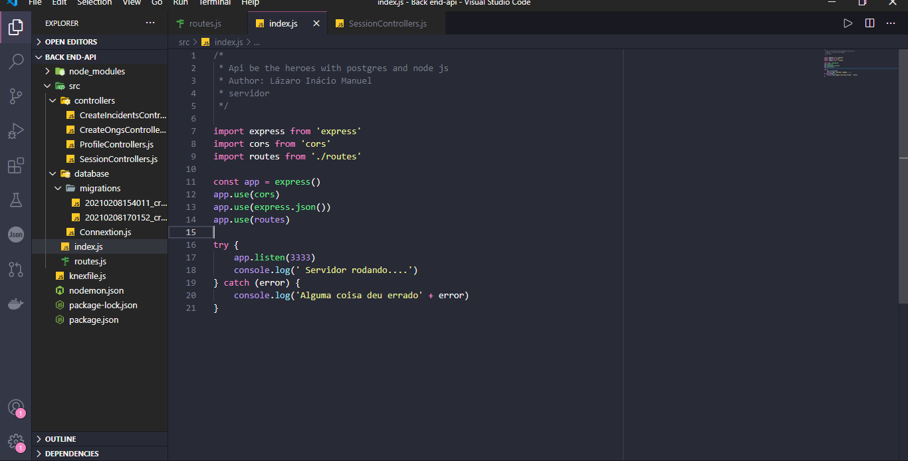
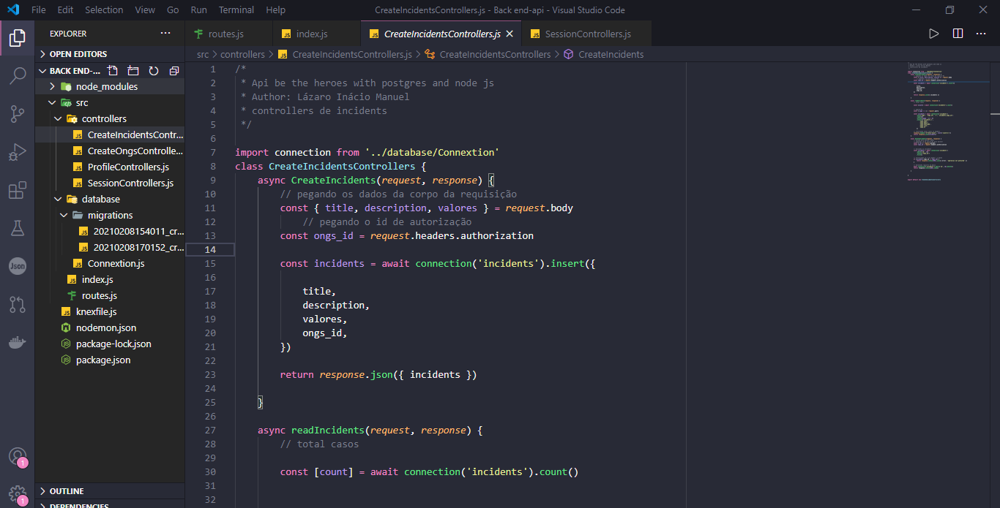

# APi rest be the heroes

Durante este tempo tive apredendo alguns bootcamps  **[RocketSeat](https://rocketseat.com.br/)** sobre nodejs e desenvolvemos esta aplicação de back end.

 <h1 align = center>
    
</h1>
 <h1 align = center>
    
</h1>

## 📚 Páginas
O site é composto por 4 diferentes páginas: 

  - **Página de Home:** Essa página é uma tela de logon;
  - **Página de cadastro :** Está pagina é serve para cadastramento de usuario  
  - **Página de logado:** Está pagina é a pagina de logado, depois do usuário ter feito o logon. 
  - **Página para cadastrar novos casos:** Está é a pagina para registro de novos casos

  ## 💻 Tecnologias utilizadas
  - Node js
  - Knex
  - Postgres
  - Docker

obs.: Para o funcionamento Do projecto deves configurar seguindo os seguintes pasos: 
#Project setup

--yarn or npm install

#Compiles and hot-reloads for development

--yarn dev or npm dev

#Compiles and minifies for production

---yarn build

🐱‍👤 Desenvolvido por <strong>Lázaro Inácio Manuel</strong>   -----   Me adicione no <a href="https://www.linkedin.com/in/l%C3%A1zaro-in%C3%A1cio-manuel-9264971b3/"target="_blank">Linkedin</a>

